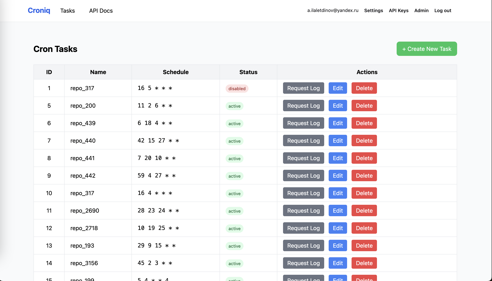
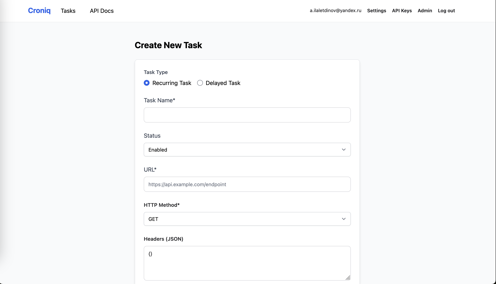
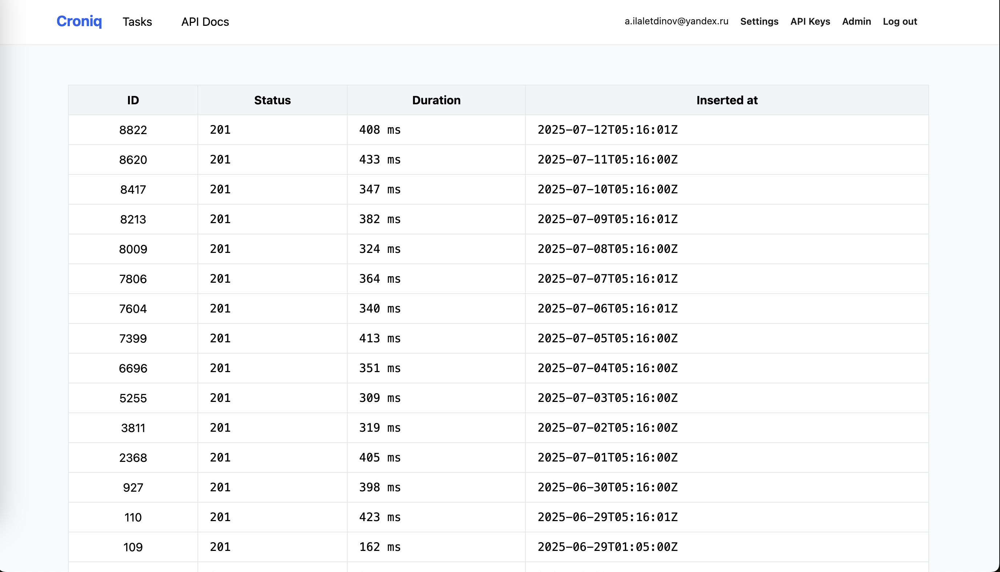

<!--
SPDX-FileCopyrightText: Copyright (c) 2025-2026 Almaz Ilaletdinov <a.ilaletdinov@yandex.ru>
SPDX-License-Identifier: MIT
-->
# Croniq

[](https://github.com/yourusername/blablatdinov/croniq)
[](LICENSE)
[](https://github.com/XAMPPRocky/tokei_rs)
[](https://hitsofcode.com/github/blablatdinov/croniq/view)

_A modern, open-source job scheduler built with Elixir and Phoenix_

---

## ✨ Features

- **HTTP Task Scheduling**: Trigger any API endpoint on a schedule
- **Full Cron Syntax**: Supports standard cron expressions with seconds precision
- **Retry Mechanism**: Automatic retries with exponential backoff
- **Web UI & REST API**: Manage jobs through both interfaces
- **Lightweight**: Minimal resource usage

---

**Live demo:** [croniq.ilaletdinov.ru](https://croniq.ilaletdinov.ru)

The Croniq web interface allows you to manage scheduled jobs through a modern dashboard:

<table>
  <tr>
    <td align="center">
      <br/>
      <b>Task List</b><br/>
      View all jobs, their statuses, and schedules
    </td>
    <td align="center">
      <br/>
      <b>Create Task</b><br/>
      Convenient form for creating a new job
    </td>
    <td align="center">
      <br/>
      <b>Request Log</b><br/>
      Execution history and HTTP request logs
    </td>
  </tr>
</table>

---

## 🚀 Quick Start

**Requirements:**
- Elixir 1.14+
- PostgreSQL 12+
- Node.js 16+ (for assets)

**Installation:**
```bash
git clone https://github.com/yourusername/croniq.git
cd croniq
mix deps.get
cd assets && npm install && cd ..
mix ecto.setup
mix phx.server
```
Visit [http://localhost:4000](http://localhost:4000) in your browser.

---

## 📚 Usage

### API Example: Create a New Job

```bash
curl -X POST http://localhost:4000/api/jobs \
  -H "Content-Type: application/json" \
  -d '{
    "name": "daily-backup",
    "schedule": "0 3 * * *",
    "url": "https://api.example.com/backup",
    "method": "POST",
    "headers": {
      "Authorization": "Bearer your-token"
    },
    "body": {
      "database": "production"
    }
  }'
```

### List All Jobs

```bash
curl http://localhost:4000/api/jobs
```

### Web UI

- View, create, edit, and delete scheduled tasks via the web dashboard.
- Real-time status and logs for each job.

---

## ⚙️ Configuration

- All configuration is managed via `config/*.exs`.
- Database settings: `config/dev.exs`, `config/prod.exs`
- Environment variables can be used for secrets and production settings.

---

## 🏗️ Architecture Overview

- **Elixir + Phoenix**: Robust, concurrent backend.
- **Quantum**: Used for cron-like scheduling.
- **Ecto**: Task persistence in PostgreSQL.
- **HTTPoison**: Executes HTTP requests for tasks.

**How it works:**
- Each task is stored in the database and scheduled via Quantum.
- When a task is due, Croniq sends an HTTP request as specified.
- Retries and status updates are handled automatically.
- Both REST API and Web UI are available for management.

---

## 🤝 Contributing

We welcome contributions! To get started:

1. Fork the repository
2. Create a new branch (`git checkout -b feature/my-feature`)
3. Make your changes
4. Commit and push (`git commit -am 'Add new feature' && git push origin feature/my-feature`)
5. Open a Pull Request

---

## 🛡️ Security

- All user input is validated and sanitized.
- Built-in CSRF protection and secure session management.
- Please report vulnerabilities via GitHub Issues.

---

## 🗺️ Roadmap

- [ ] Task history and logs
- [ ] Advanced authentication (OAuth, SSO)
- [ ] Multi-tenant support
- [ ] More integrations (Slack, Email, etc.)
- [ ] Retry Mechanism

---

## ❓ FAQ

**Q: Can I use custom HTTP headers?**  
A: Yes, just specify them in the `headers` field when creating a job.

---

## 📄 License

This project is licensed under the MIT License. See the [LICENSE](LICENSE) file for details.

---

## 🔗 Links

- [Elixir](https://elixir-lang.org/)
- [Phoenix](https://www.phoenixframework.org/)
- [Quantum](https://github.com/quantum-elixir/quantum-core)
- [LiveView](https://hexdocs.pm/phoenix_live_view/Phoenix.LiveView.html)

---

_Made with ❤️ by the Croniq community_
